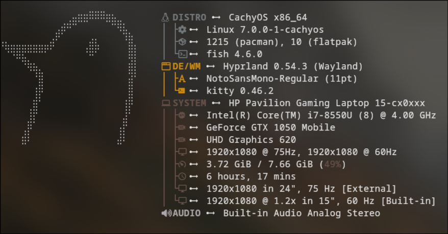

# dotfiles



### Linux distribution

Cachy-OS (April 2026)

### Window manager components

- window manager: **hyprland**
- status bar: **waybar**
- notification daemon: **swaync**		
- wallpaper manager: **awww**
- screensaver: **waylock**
- multimedia framework: **pipewire** / **wireplumber**
- network: **nm-applet???**
- bluetooth: **bluethootctl**
- clipboard manager: **cliphist**

### Applications

- Shell: **fish**
- Editor: **neovim**
- Terminal: **kitty**
- Calculator: **Qalculate**
- Web browser: **firefox**
- File browsing: **pcmanfm-qt**
- Image viewer: **gwenview**
- Audio mixer: **pavucontrol**
- Launcher: **rofi**
- Screenshot: **grim** / **swappy**
- Dialoging program: **yad**

### SDDM login manager

- config file: ```/etc/lib/sddm/sddm.conf.d```	

### Fonts configuration

- terminal font: ```NotoSansMono-Regular```

### Keys combo

- run
    ```hypr\scripts\KeyHints.sh``` or ```Win+H```
